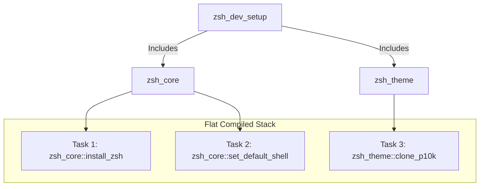

# Recipes Subsystem: Developer Guide & Reference Documentation

The **Recipes Subsystem** within the RSD (Rapid Script Developer) framework provides a declarative, modular, and portably idempotent provisioning engine. By grouping structural configurations and host modifications into cohesive, composable **Recipes**, RSD can safely execute, dry-run, and rollback multi-stage setups across Arch Linux, Debian, and Ubuntu systems.

---

## 1. Architectural Concepts

The Recipes Subsystem operates on three fundamental abstractions:

| Component | Definition | File / Class Scope |
| :--- | :--- | :--- |
| **Task** | The smallest atomic unit of execution. Declares pre-flight conditions, payload actions, post-flight verifications, and optional rollback logic. | Registered via `rsd::recipe::register_task` |
| **Recipe** | A collection of related Tasks or an inclusion of other sub-recipes. | Written as `.recipe` files under `lib/recipe/` |
| **Engine** | The core orchestrator. Compiles a flat chronological task stack, checks necessity guards, applies modifications, and handles failures. | Controlled by `lib/recipe.lib` |

### Flat Task Stack Compilation
To prevent runtime isolation or split-brain states during nested composition, RSD does **not** execute nested recipes in separate context blocks. Instead, when a master recipe includes other sub-recipes (using `rsd::recipe::include_recipe`), they are **recursively compiled** into a single, flat chronological list of Tasks (`RSD_REGISTERED_TASKS`).



This flat compile allows:
- Transparent pre-flight simulations (`--dry-run`).
- Global chronological stack tracking (`RSD_COMPLETED_STACK`).
- Uniform, trans-recipe backward chronological rollbacks.

---

## 2. The Task Lifecycle & Idempotency

Every Task registered in a recipe executes in four explicit phases:

```
  [Pre-Check] ──────(Succeeded)──────> [SKIPPED] (Already Satisfied)
       │
    (Failed)
       ▼
   [APPLY] ───────(Failed)──────────> [RECOVERY FLOW] (Rollback or Forward Halt)
       │
   (Succeeded)
       ▼
 [Post-Check] ─────(Failed)──────────> [RECOVERY FLOW] (Rollback or Forward Halt)
       │
   (Succeeded)
       ▼
   [SUCCESS] ───────────────────────> Added to RSD_COMPLETED_STACK
```

### The Idempotency Imperative
Every step in a recipe **must be idempotent**. A task is idempotent if running it multiple times produces the exact same system state without redundant executions or side effects. 

To achieve this:
1. **Pre-Check Hook (`--pre-check`)**: A function that queries the host system to determine if the desired state is already satisfied. If this function returns success (`0`), the entire step is skipped.
2. **Post-Check Hook (`--post-check`)**: A function that queries the host system *after* execution to verify the state was correctly applied. If it fails, the step is treated as a failed application.

> [!IMPORTANT]
> A recipe should be capable of failing in the middle, having the user correct the environment, and being re-run directly. The pre-check necessity checks will automatically skip all completed steps up to the point of failure.

---

## 3. Administrative Boundaries & Privilege Elevation

RSD recipes must run within the target user's context (e.g. `/home/username/`) to prevent file ownership contamination (e.g., generating user configurations under `/root/`). 

### The Elevation Protocol: Sudo Implying
Users should not need to explicitly specify administrative paths or sudo hops (e.g. targeting `sudo://root`). Instead, **implicit privilege elevation** must occur dynamically only when required for specific system-level commands (like `apt-get` or `chsh`):

1. **User Context Execution**: The main recipe runs under the standard user environment. Files like `.zshrc` or `.p10k.zsh` are written and customized under the standard `$HOME` directory with user ownership.
2. **Targeted Elevation**: When system modification is required, use `lib/sudo.lib`'s `rsd::l::sudo::run` locally, or append `,sudo://root` to `$RSD_REMOTE_TARGET` remotely, to run a specific command with elevated privileges.

#### Example: Elevated chsh execution
```bash
function rsd::recipe::zsh_core::shell_apply() {
    local zsh_path=$(which zsh 2>/dev/null)
    # rsd::l::target::exec_sudo transparently handles:
    #   - Local: sudo.lib askpass pipeline
    #   - Remote: appends ,sudo://root to target string
    rsd::l::target::exec_sudo "" "chsh" "-s" "$zsh_path" "$USER"
}
```

---

## 4. Fault Tolerance & Recovery Modes

When a task fails during application or fails its post-check verification, the engine resolves the failure based on its configured recovery strategy:

```bash
rsd::recipe::register_task \
    --name "my_step" \
    --apply "my_payload" \
    --recovery "rollback" \
    --rollback "my_cleanup"
```

### A. Recovery: `forward` (Default)
- **Behavior**: Halts execution immediately and displays an instruction warning.
- **Goal**: Protects system state while leaving changes intact. Once the environmental blocker is resolved, re-running the command skips all completed tasks and picks up exactly where it failed.

### B. Recovery: `rollback`
- **Behavior**: Halts execution immediately and triggers **Backward Recovery**.
- **Rollback Cascade**: Pops all successfully completed tasks from `RSD_COMPLETED_STACK` in **exact reverse chronological order** (last in, first out) and executes their corresponding `--rollback` cleanup payloads.

### C. Recovery: `ignore` (Soft-Failure)
- **Behavior**: Prints a warning diagnostic but continues execution of the next step.
- **Goal**: Used for optional packages or secondary enhancements (e.g., companion packages that fail to install but are not fatal to the overall workflow).

---

## 5. Guide: Writing Your First Recipe

Creating a new recipe requires writing a declarative recipe module under `lib/recipe/<name>.recipe`.

### Step 1: Create the Recipe file
Sourcing guards must check `RSD_ON` to prevent direct standalone shell executions. Load any system libraries using short-circuit evaluation.

```bash
#!/usr/bin/env bash

# @see docs/recipes.md
# @see AGENTS.md

if [[ ! -v RSD_ON || $RSD_ON -ne 1 ]]; then
    echo "This is a RSD library file. It should not be executed directly."
    echo "Please call 'rsd' to use it."
    exit 12
fi

[[ "$RSD_SUDO_LIB" != "1" ]] && source "$(rsd::get_libdir_file lib/sudo.lib)"
```

### Step 2: Declare the Registration Hook
Every recipe file must implement `rsd::recipe::<basename>::register` to define its steps.
Use `rsd::l::target::` helpers for inline hooks and `rsd::l::recipe::install_pkg` for package installation:

```bash
# @param none
# @return none
function rsd::recipe::my_app::register() {
    # Simple tasks can be fully declarative using target:: helpers
    rsd::recipe::register_task \
        --name "my_app::install_packages" \
        --pre-check "rsd::l::target::has_bin my-app" \
        --apply "rsd::l::recipe::install_pkg my-app" \
        --recovery "forward"

    # Complex tasks use custom callbacks
    rsd::recipe::register_task \
        --name "my_app::configure_settings" \
        --pre-check "rsd::l::target::file_exists \$HOME/.myapp.conf" \
        --apply "rsd::recipe::my_app::config_apply" \
        --recovery "rollback" \
        --rollback "rsd::l::target::exec rm -f \$HOME/.myapp.conf"
}
```

### Step 3: Implement Custom Hook Callbacks
Callbacks are only needed for complex logic that cannot be expressed as a single `rsd::l::target::` inline call. Use `rsd::l::target::exec` to route commands transparently:

```bash
# Config apply: uses target::exec for transparent local/remote routing
function rsd::recipe::my_app::config_apply() {
    rsd::l::target::exec sh -c "echo 'theme=dark' > \$HOME/.myapp.conf"
}
```

> **Note**: You should NOT manually branch on `$RSD_REMOTE_TARGET`. Use `rsd::l::target::exec` and its derived helpers instead. See `lib/target.lib` for the full API.

## 6. Recipe Dependencies & Composition

To build complex systems, the framework allows recipes to compose or depend on other upstream recipes. This is managed sequentially through `rsd::recipe::include_recipe`.

### A. Composing Master Recipes
A master recipe aggregates multiple sub-recipes sequentially to compile a single unified stack:

```bash
function rsd::recipe::my_dev_stack::register() {
    # Include base shell utilities
    rsd::recipe::include_recipe "zsh_core"

    # Include custom application configurations
    rsd::recipe::include_recipe "my_app"
}
```

### B. Declaring Recipe Prerequisites (Self-Healing Dependencies)
If a sub-recipe depends on upstream configurations to function correctly (for example, `zsh_theme` or `zsh_plugins` requiring Zsh and Oh My Zsh base to be present), it must explicitly declare that dependency as a prerequisite at the very beginning of its registration hook:

```bash
function rsd::recipe::zsh_theme::register() {
    # Prerequisite: Core Zsh and Oh My Zsh base must be satisfied first
    rsd::recipe::include_recipe "zsh_core"

    # Register theme configuration tasks
    rsd::recipe::register_task \
        --name "zsh_theme::clone_p10k" \
        --pre-check "rsd::recipe::zsh_theme::theme_pre" \
        --apply "rsd::recipe::zsh_theme::theme_apply" \
        --recovery "forward"
    # ...
}
```
If a user runs the `zsh_theme` recipe directly (`./rsd recipe run zsh_theme`), the engine automatically detects and satisfy the prerequisite tasks from `zsh_core` first.

### C. Double-Inclusion Protection
To prevent task duplication when multiple sub-recipes declare the same prerequisite, the compiler implements a dynamic **Double-Inclusion Guard** using the global `RSD_INCLUDED_RECIPES` registry. 

Each recipe name is recorded in the registry upon its first compile invocation:
- When a recipe is included, the compiler checks if it has already been registered.
- If it has, the compiler skips re-registration instantly.
- This ensures that in master compositions like `zsh_dev_setup` (which includes `zsh_core` and then includes multiple sub-recipes that also depend on `zsh_core`), the `zsh_core` tasks are registered **exactly once**.

### D. Necessity Check Efficiency
Because every task in RSD defines a `--pre-check` necessity guard, resolving dependencies has zero performance penalty if they are already satisfied on the host system. The engine runs pre-checks, finds them satisfied, skips them instantly (taking less than a millisecond), and proceeds straight to the target payload.

---

## 7. Testing & CLI Usage

### Simulating (Dry-Run)
Always run dry-runs first to review planned executions:

```bash
# Locally
./rsd recipe run zsh_dev_setup --dry-run --verbose

# Remotely targeting an alias
rsd @target recipe run zsh_dev_setup --dry-run --verbose
```

### Writing Automated Tests
Write tests using the BATS framework under `tests/unit/` to assert task registration or recovery behavior:

```bash
@test "rsd::l::recipe::execute_engine respects skips" {
    RSD_REGISTERED_TASKS=()
    task_pre() { return 0; } # Already satisfied
    task_apply() { echo "EXEC"; return 0; }
    
    rsd::recipe::register_task \
        --name "test_task" \
        --pre-check "task_pre" \
        --apply "task_apply"

    run rsd::l::recipe::execute_engine 0 0
    [ "$status" -eq 0 ]
    [[ "$output" == *"Task 'test_task' is already satisfied."* ]]
    [[ "$output" != *"EXEC"* ]]
}
```

---

## 8. Security: Download and Execute

Recipes that download and execute remote scripts must follow strict security protocols to prevent three classes of vulnerability:

### Threat Model

| CWE | Vulnerability | Attack Vector |
| :--- | :--- | :--- |
| **CWE-377** | Predictable Temp File | Attacker pre-creates a symlink at `/tmp/known_name.sh` pointing to a sensitive file. When `curl -o` writes to it, the symlink target is overwritten. |
| **CWE-367** | TOCTOU Race | Attacker replaces the downloaded file between the download step and the execution step. |
| **CWE-494** | Download of Code Without Integrity Check | `sh -c "$(curl ...)"` executes code from memory with no inspection, checksum verification, or audit trail. |

### Forbidden Patterns

```bash
# FORBIDDEN: Predictable path — symlink attack (CWE-377)
curl -o /tmp/install.sh https://example.com/install.sh
sh /tmp/install.sh

# FORBIDDEN: Pipe to shell — no verification possible (CWE-494)
sh -c "$(curl -fsSL https://example.com/install.sh)"
curl -fsSL https://example.com/install.sh | sh
```

### Required Pattern

Use `rsd::l::target::fetch_and_exec` for all download-and-execute workflows:

```bash
# SECURE: Unpredictable temp path + restrictive perms + guaranteed cleanup
rsd::l::target::fetch_and_exec \
    "https://example.com/install.sh" \
    "sh" "--unattended"
```

This function enforces:
1. **`mktemp`-generated paths**: Cryptographically unpredictable, immune to pre-creation attacks.
2. **`chmod 0700`**: Owner-only access prevents other users from modifying the file.
3. **Guaranteed cleanup**: The temp file is deleted after execution, even on failure.
4. **Disk-based execution**: The script touches disk, enabling future SHA256 verification.

### Manual Temp File Usage

If you need to create temp files for non-download purposes, use `rsd::l::target::mktemp`:

```bash
# Create a secure temp file
tmpfile=$(rsd::l::target::mktemp "rsd-mydata.XXXXXX")

# ... use the file ...

# ALWAYS clean up, even on failure paths
rsd::l::target::exec rm -f "$tmpfile"
```

> See also: `AGENTS.md` Section 8 (Secure Temporary File Protocol) for the mandatory agent rules.
